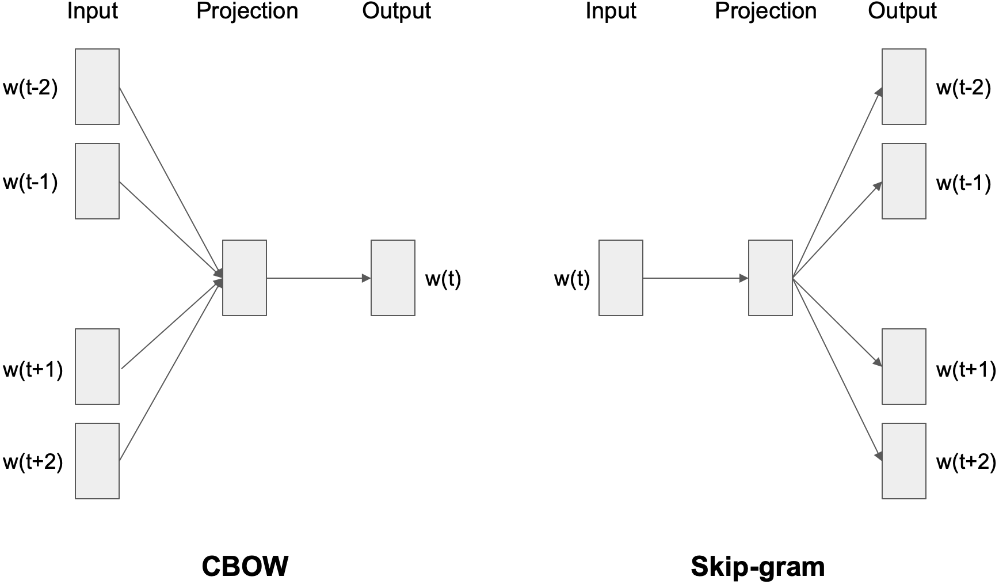
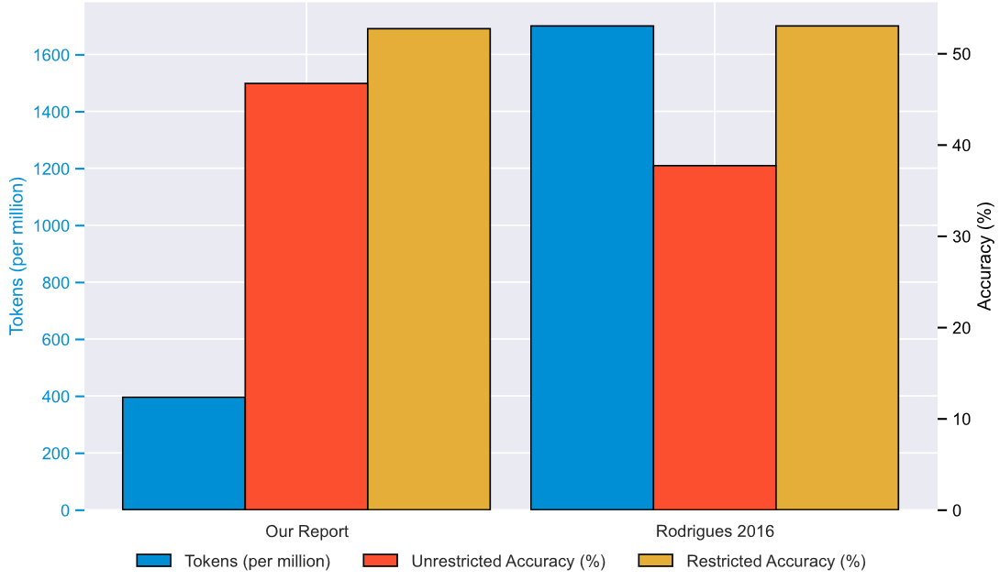

# Portuguese Word Embeddings

This project explores **HAL**, **CBOW**, and **Skip-Gram** models for generating word embeddings in Portuguese, evaluating semantic relationships and word analogy tasks.

---

## Key Takeaways

- **Hyperspace Analogue to Language (HAL)**[^1]:
  - Very simple method that just creates co-occurrence matrices using a sliding window approach.
  - Overall performance is not very good though that's expected.
  - For example for the phrase, "O João comeu o bolo do Miguel" and using a window width of five words you would get the following matrix:

    | **Vocabulary** | **'bolo'** | **'comeu'** | **'do'** | **'João'** | **'Miguel'** | **'o'** |
    | -------------- | ---------- | ----------- | -------- | ---------- | ------------ | ------- |
    | **'bolo'**     | 0.0        | 4.0         | 0.0      | 3.0        | 0.0          | 7.0     |
    | **'comeu'**    | 0.0        | 0.0         | 0.0      | 5.0        | 0.0          | 4.0     |
    | **'do'**       | 5.0        | 3.0         | 0.0      | 2.0        | 0.0          | 5.0     |
    | **'João'**     | 0.0        | 0.0         | 0.0      | 0.0        | 0.0          | 5.0     |
    | **'Miguel'**   | 4.0        | 2.0         | 5.0      | 1.0        | 0.0          | 3.0     |
    | **'o'**        | 0.0        | 5.0         | 0.0      | 4.0        | 0.0          | 3.0     |
    - Each cell in this matrix signifies the aggregated co-occurrence count of a specific word pair. One important aspect is that this matrix distinguishes between word order in a pair - the sequence "xy" and "yx" count towards separate cells - therefore we have that, the rows show the co-occurrence for words preceding the target word, while the column the data for words succeeding it.
    - Finally, in order to get a word representation, the corresponding row/column pair for a word it is merged to produce a co-occurrence vector of length $2n$
- **Continuous Bag of Words (CBOW)**[^2]
  - Predicts a target word using its surrounding context.
  - Seems to be less effective with rare words.
- **Skip-Gram**[^2]
  - Predicts context words given a target word.
  - Outperformed CBOW in semantic tasks, especially for less frequent words!

## Main Result

Despite the smaller dataset, the results, using Skip-Gram, were actually **surprisingly** competitive and in some aspects superior against the original reported benchmark results from Rodrigues[^3].

For more details check the main [document](WordEmbeddings.pdf).

## References
[^1]: Kevin Lund and Curt Burgess. [Producing high-dimensional semantic spaces from lexical co-occurrence.](https://link.springer.com/article/10.3758/BF03204766) Behavior Research Methods, Instruments, & Computers, 28:203–208, 1996.
[^2]: Tomas Mikolov, Kai Chen, Greg Corrado, and Jeffrey Dean. [Efficient estimation of word representations in vector space.](https://arxiv.org/abs/1301.3781) arXiv preprint arXiv:1301.3781, 2013.
[^3]: José Pedro Pinto, Paula Viana, Inês Teixeira, and Maria Andrade. [Improving word embeddings in portuguese: increasing accuracy while reducing the size of the corpus.](https://doi.org/10.7717/peerj-cs.964).